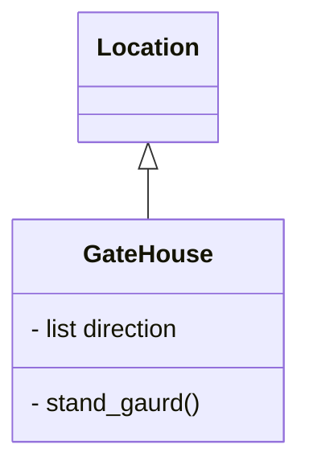

# Game Name
**Dale - Student Number 20102723** 
`This is a single player, adventure text-based game set in a shopping mall. The objective is for the user to escape the mall during black friday sales - hopefully with a good deal in hand ` 

## Introduction
I am working at a boutique Perth-based software development company. This project is my final assignment for the Applied Programming Python Unit.

I will be writing a simple, single player, vintage text-based adventure game in Python3 (version 3.8).

The game will consist of different locations (rooms, etc.) which will be placed in a simple 2-dimensional grid (like a Chess board).
 
Not all locations in the grid will be populated.
 
Players can only move between adjacent locations and each location must have at least one neighbour that can be reached. Players cannot move between rooms diagonally.

Locations do not have to be reachable from all neighbouring locations. For example, a room might have four neighbouring locations and be accessible from only two. 

The program is modular, and takes an object-oriented approach. 

## User Documentation
### Overview and rules
The user starts in a shopping mall - the objective is to escape the mall during Black Friday sales. While the main objective is to escape, the user will fail if they do not leave with a good bargain - as such, they will also need to procur something of value.

The map is made up of 5 rooms in the following layout:
[Lobby] -- [Electronics Store]
  |                |
[Food Court] -- [Bank]  

                   |
         [Clothing Boutique]
       

Most rooms have a vendor that you can buy items from. Gaining money and purchasing/selling items is the main gameplay of the game.

#### Rooms
The rooms are set out in the following fashion:

**Food Court** -
This is where the player starts.
*Events*

*NPCs*

**Bank**
*Events*

*NPCs*

**Clothing Boutique** -
*Events*

*NPCs*

**Electronics Store** -
*Events*

*NPCs*

**Lobby** -
This is the main goal/escape area.
*Events*

*NPCs*

### Game play
The available commands to the user ("move", "get" and "use") to be used in combination with directions/items are given at the beginning of the adventure. The program will also state at the beginning the main goal of the game.

Players can move around the map by specifying North, East, West or South to move in a direction corresponding to the specificied cardinal value.

Coins are the main "currency" in the game - the player starts with 5 coins and can gain or lose coins through purchasing or selling items, or through events in game.

To win, the player must leave the shopping center with an item of high enough value. Every move the player makes adds to a turn counter - when the turn counter hits a certain number, the shopping center "closes" and the player is no longer able to escape.

The player can lose in two ways:
-They leave the shopping center empty-handed
-They remain in the mall afterhours (ie; turn counter elapses)

## Developer Documentation
### Files and resources

### User Requirements Specification
Requirements:
-A name that reflects the adventure's world
-At least four locations
-Either at least two properties of items and/or two characters that can be interacted with
-5 instances of items that can be stored in a rucksack
-A simple 2D map
-Binary search functionality
-At least one conditional action

Self-imposed requirements:
-A turn counter

#### Class Diagram

