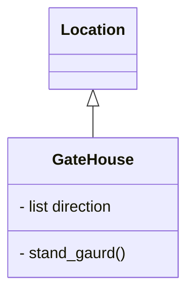

# Code Black (Friday)
**Dale - Student Number 20102723** 
`This is a single player, adventure text-based game set in a shopping mall. The objective is for the user to escape the mall during black friday sales - hopefully with a good deal in hand ` 

## Introduction
I am working at a boutique Perth-based software development company. This project is my final assignment for the Applied Programming Python Unit.

I will be writing a simple, single player, vintage text-based adventure game in Python3 (version 3.8).

The game will consist of different locations (rooms, etc.) which will be placed in a simple 2-dimensional grid (like a Chess board).
 
Not all locations in the grid will be populated.
 
Players can only move between adjacent locations and each location must have at least one neighbour that can be reached. Players cannot move between rooms diagonally.

Locations do not have to be reachable from all neighbouring locations. For example, a room might have four neighbouring locations and be accessible from only two. 

The program is modular, and takes an object-oriented approach. 

## User Documentation
### Overview and rules
The user starts in a shopping mall - the objective is to escape the mall during Black Friday sales. While the main objective is to escape, the user will fail if they do not leave with a good bargain - as such, they will also need to procur something of value.

The map is made up of 5 rooms in the following layout:
[Lobby] -- [Electronics Store]
  |                |
[Food Court] -- [Bank]
                   |
         [Clothing Boutique]      

Most rooms have a vendor that you can buy items from. Gaining money and purchasing/selling items is the main gameplay of the game.

#### Rooms
The rooms are set out in the following fashion:

**Food Court** 
This is where the player starts.
*Events*
- Player may try to exit north but will be blocked by a crowd of people (that only disappear when the turn counter expires)
-If player checks vending machine in corner, they can find a few coins behind the machine.
-Player can also purchase a drink from the machine, which they drink instantly.

*NPCs*
-Vendor selling a fast food: players can purchase food from them. This does not count as a high value item for leaving.
-Vendor off shift sitting in corner - player can use the pen from the bank vendor to fake a membership card to fool the tech bouncer.

**Bank**
*Events*
-The way leading north is blocked - player's will need to buy a membership card to get through. 
***To come up with more ideas***

*NPCs*
-Bank vendor: the player can sign up to a credit card but this is deemed as a non-valuable item. The player can also take the pen from the vendor. The bank vendor will pay the player if they sign someone else up to the credit card.
-Tech bouncer: Prevents them entering the exclusive tech store unless they have a membership card. 

**Clothing Boutique** 
*Events*
***To come up with more ideas***

*NPCs*
-Vendor 1: Selling an item that the player likely does not want.
-Vendor 2: Selling a cheaper item that the player will be oaky with - this counts as a high value item for leaving.

**Electronics Store** 
*Events*
***To come up with more ideas***

*NPCs*
-NPC blocking the way to the exit: wants the more expensive item that the player likely does not want.

**Lobby** 
This is the main goal/escape area.
*Events*
***To come up with more ideas***

*NPCs*
-Person asking for whatever item the player might have (allows the player to get rid of excess items)

### Game play
The available commands to the user ("move", "get" and "use") to be used in combination with directions/items are given at the beginning of the adventure. The program will also state at the beginning the main goal of the game.

Players can move around the map by specifying North, East, West or South to move in a direction corresponding to the specificied cardinal value.

Coins are the main "currency" in the game - the player starts with 5 coins and can gain or lose coins through purchasing or selling items, or through events in game. When they player looks down, they will occasionaly find a coin but there is a max to this (e.g. 10 coins).

To win, the player must leave the shopping center with an item of high enough value. Every move the player makes adds to a turn counter - when the turn counter hits a certain number, the shopping center "closes" and the player is no longer able to escape.

The player can lose in two ways:
-They leave the shopping center empty-handed
-They remain in the mall afterhours (ie; turn counter elapses)

#### Key Words
-Move: used to get around the map (e.g. "move east")
-Get: used to pick up an item ("get coin")
-Check: used to examine an object more closely (e.g. "inspect apple"). If used with keyword "wallet", it will tell the user how many coins they have. 
-Talk: Used to speak to a specific NPC (e.g. "talk banker"). If talk is used when in conversation with someone, they will discuss that topic.
-Leave: Can be used to move around map or leave a conversation. 
-Look: Used to direct attention to a part of map (e.g. "look down")
-Wait: This keyword is not advertised but can be used in combination with a number to wait a specified amount of turns.

NPC and OBJECT names will always be in CAPITAL LETTERS to denote a usable object/character.

## Developer Documentation
### Files and resources

### User Requirements Specification
Requirements:
-A name that reflects the adventure's world
-At least four locations
-Either at least two properties of items and/or two characters that can be interacted with
-5 instances of items that can be stored in a rucksack
-A simple 2D map
-Binary search functionality
-At least one conditional action

Self-imposed requirements:
-A turn counter

Steps:
1. Build ability to move around map
2. Show map with X and O to ensure you can track it
3. Build currency and a simple method of removing currency
4. Build way to start end/game
5. Add item list
6. Add key word manager
7. Add NPCs
8. Build timer
9. Bug fix

#### Class Diagram

